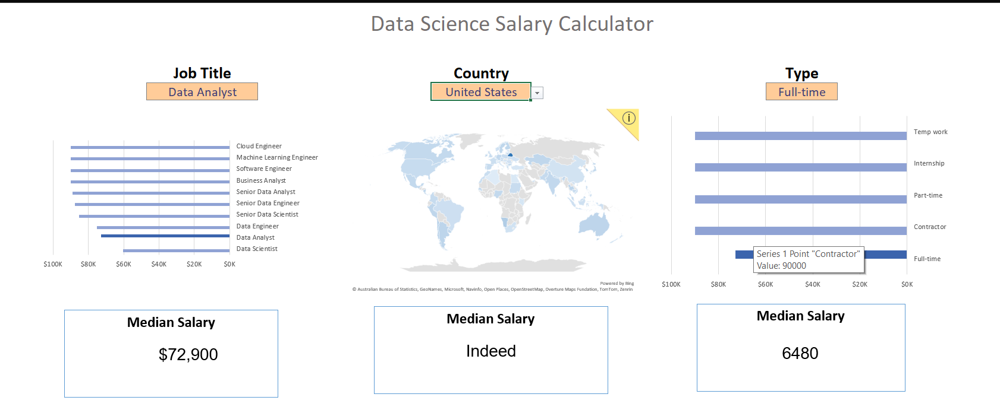

# Excel Salary Dashboard

## Overview

This Excel dashboard visualizes 2023 salary data for data-related jobs. It helps job seekers understand salary trends by job title, location, and work type.

## Key Features

- **Charts:** Bar and map charts show salary distributions and geographic differences.  
- **Formulas:** Custom `MEDIAN()` and `FILTER()` formulas enable dynamic insights.  
- **Data Validation:** Drop-down filters for job title, country, and schedule type.

## Skills Used

- 📊 Excel Charts  
- 🧮 Formulas & Functions  
- ✅ Data Validation  

## Insights

- Senior and engineering roles typically pay more than analyst positions.  
- Salaries vary significantly by country and job schedule type.

## Conclusion

This dashboard, built as part of my Excel course, demonstrates how to turn raw job data into actionable insights using Excel.
